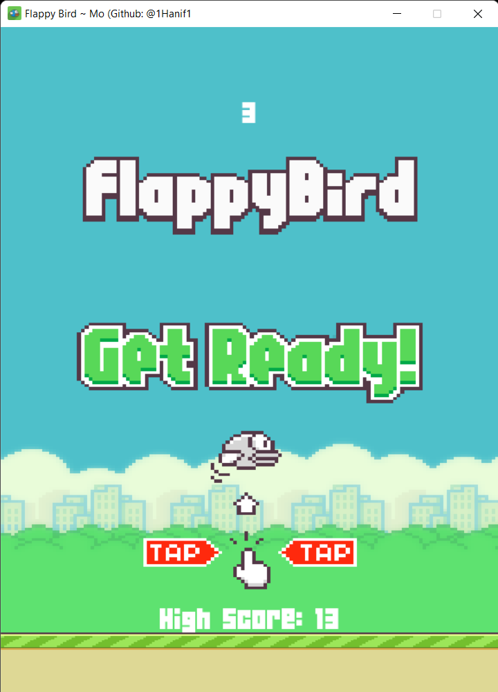
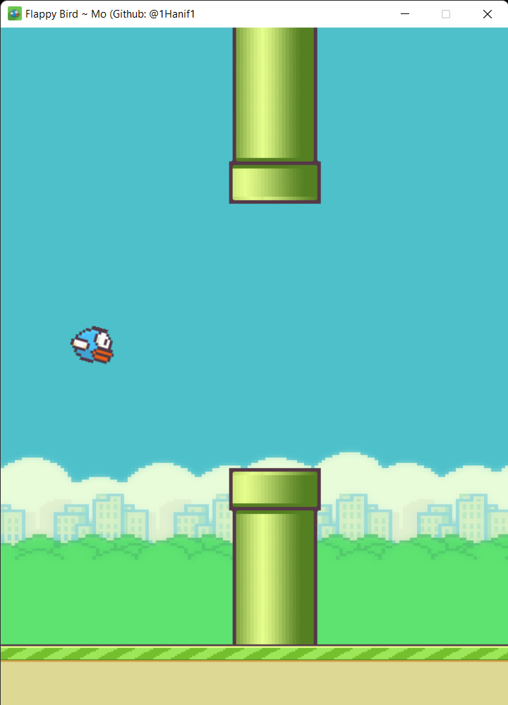

# 🐦 Flappy Bird 

## Screenshots 📸

## About Project ⚙️

- Created using python
- Used the [`pygame`](https://www.pygame.org/news) module
- Original by [Clear Code](https://www.youtube.com/channel/UCznj32AM2r98hZfTxrRo9bQ) on YouTube

## What I Learnt 📚

- How to use the pygame module
- How 2D Games work
- How Event Loop works in video games
- pygame surfaces and rectangles
- What are framerates and how they impact the video game's fluidity

## How To Play 🕹️

- Install [Python](https://www.python.org/)  
- Download the Zip file
- Extract the Zip file
- Open the directory on the terminal
- run `python main.py`

## My Socials 📲

- Github: [@1Hanif1](https://github.com/1Hanif1?tab=overview&from=2022-01-01&to=2022-01-26)
- Twitter: [@HMohammedB_](https://twitter.com/HMohammedB_)
